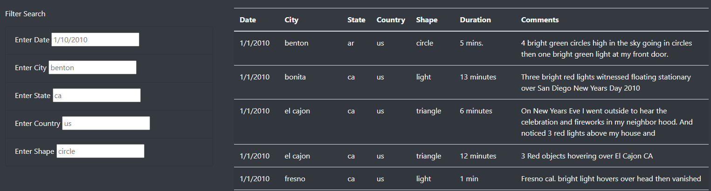
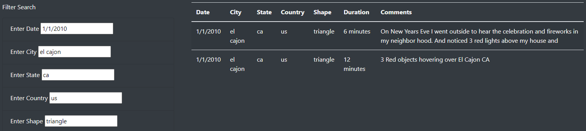

# UFOs

## Overview

The purpose of this analysis is to use JavaScript, HTML, and CSS to create a website that holds data on UFO sightings. The previous version of this website was able to filter the data by date. In this updated version we have included more filters: City, State, Country, and Shape.

## Results

### New Search Bars

Upon accessing the website the user will see a filter search section on the left portion of the website and on the right, a list of UFO sightings that includes various information about the sighting (i.e. date, city, state, etc...) The user then has the option of filtering through the list of data by certain criteria as shown below.

In this image you can see an example of a filtered search the user may perform. This particular example has every filter filled out; however, the user can choose to filter data with 1 to all of the filter options. All that is needed for the search to work is at least one filter filled out. If that particular filter does not exist in the data then nothing will be returned. 

## Summary

One of the drawbacks for this design is that it gives the user too much freedom to input data and if the data does not exist it will continually result in empty returns. 

One recommendation for further development would be to create drop down menus rather than search bars. This way every bit of data will be listed for the user to choose.

One final recommendation would be allow the search to be more lenient towards the user's input. For example, if the data is not in the exact format (i.e. capitalization), then the search will not work. It would benefit the user experience if the search input was more lenient. 